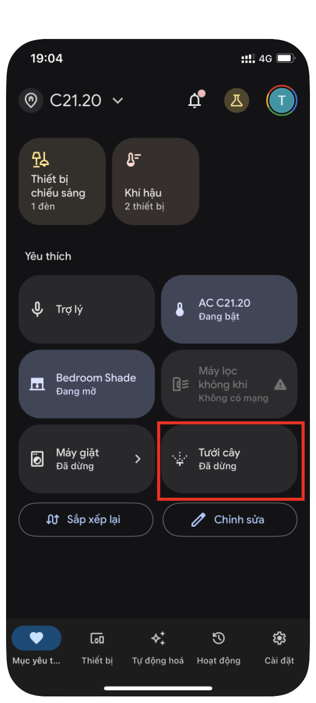
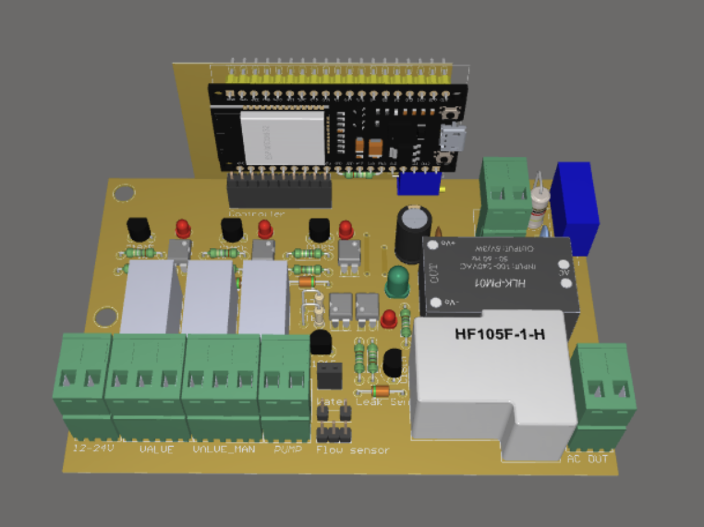
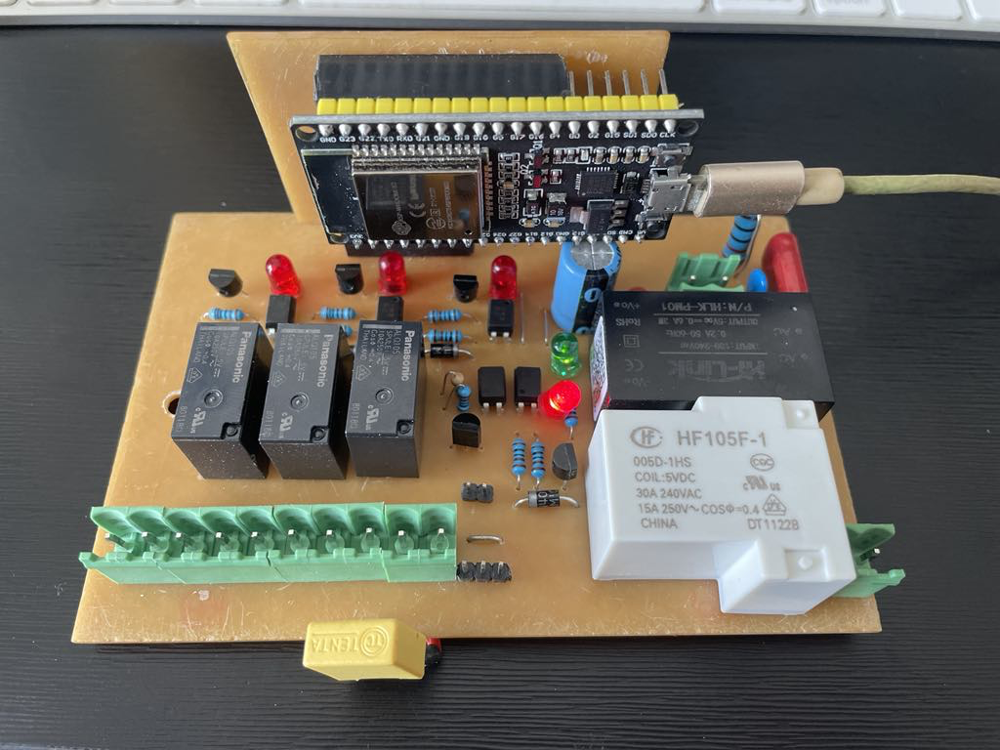
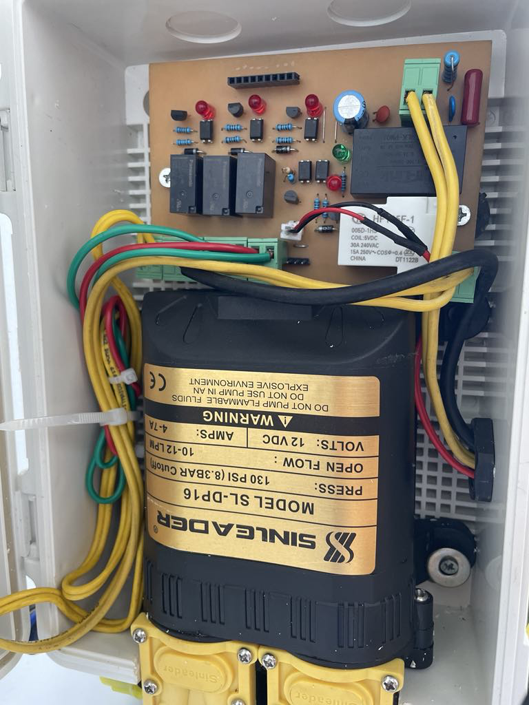
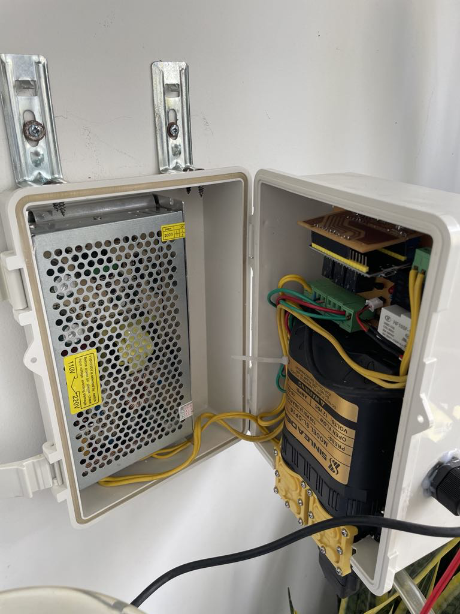
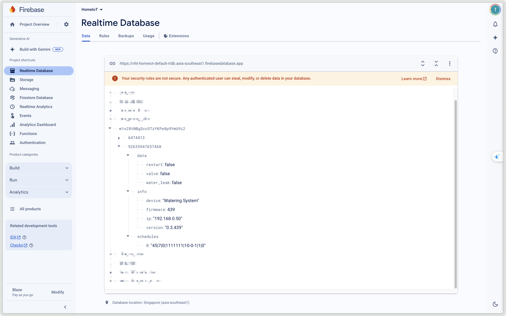
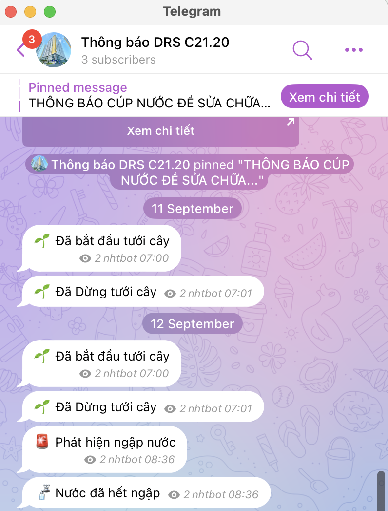

# Smart Garden

Smart garden controlled via Google home/Google assistant. Data is saved on **firebase realtime database**

## Features

- Watering timer with water amount/time
- Control via Google home/Google assistant
- Flood detection
- Monitoring water consumption
- Over voltage protection
- Watering through electronic water valve and pump

    

## Hardware

- [Base board](./Smart%20garden%20base/)

- [Controller board](./Smart%20garden%20controller/)

## Software

- [Source code](./smart-garden/)

### Database

### Notifications

